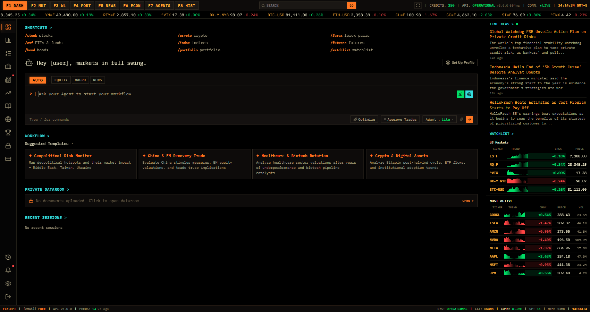

# 前端复刻参考

## 总体定位

登录后页面是一个 Bloomberg 风格的专业金融终端，而不是常规 SaaS dashboard。核心体验由三层持续存在的框架组成：

1. 顶部功能键和系统状态：F1-F8、全局搜索、credits、API 状态、连接状态、当前时间。
2. 实时行情条：横向滚动 ticker，展示指数、期货、外汇、加密货币、商品和大盘股。
3. 终端工作区：左侧图标导航、中央主工作区、右侧新闻和 watchlist 信息栏、底部状态栏。

复刻时应优先保证信息密度、等宽字体、低圆角、强边框、终端色彩和实时状态感。

## 桌面布局

抓取视口：1700 x 900。

主要区域：

| 区域 | 位置和尺寸参考 | 功能 |
| --- | --- | --- |
| 顶部功能键条 | y=0-32 | F1 DASH 到 F8 HIST，搜索框，GO，fullscreen，credits/API/connection/time |
| 行情 ticker | y=32-54，全宽 | 双段或循环滚动市场报价 |
| 左侧 icon rail | x=0-48，y=54-880 | 主要功能导航，当前项用橙色边线和图标高亮 |
| 中央主区 | x=48-1400，y=54-880 | 各功能页主体内容 |
| 右侧信息栏 | x=1400-1700，y=54-880 | Live News、Watchlist、Most Active |
| 底部状态栏 | y≈876-900 | 品牌、账号计划、API、feeds、system、latency、connection、uptime、memory、time |

Dashboard 桌面参考图：

## 移动布局

抓取视口：390 x 844。

移动端策略：

| 区域 | 变化 |
| --- | --- |
| 顶部功能键 | 收敛为 hamburger、搜索、GO、fullscreen、连接状态 |
| 行情 ticker | 保留一行横向滚动 |
| 左侧 rail | 隐藏，改为弹出菜单 |
| 右侧信息栏 | 不常驻，主体内容优先 |
| Dashboard 内容 | 纵向堆叠，但模板卡片仍可使用紧凑双列 |
| 输入区 | Agent 输入、模式按钮和执行按钮堆叠更紧，需要增加触控尺寸 |

移动 Dashboard：

移动菜单：

## 视觉系统

| 项目 | 观测值 |
| --- | --- |
| 主字体 | IBM Plex Mono, Courier New, monospace |
| body 字号 | 13px |
| H1 字号 | 16px |
| 输入字号 | 10px 到 12px |
| 背景 | rgb(0, 0, 0) |
| 主文字 | rgb(237, 232, 200) |
| 次级文字 | 偏暗米黄/灰褐 |
| 强调橙 | rgb(255, 119, 34) |
| 正向绿 | 高饱和终端绿 |
| 负向红 | 高饱和终端红 |
| Cyan 状态 | 用于 SYSTEM、API、账户 credits 等状态 |
| 边框 | 暗棕、橙色高亮边框，低圆角或无圆角 |

设计原则：

- 不使用大面积卡片阴影，主要靠 1px 边框、色块标签和分割线建立层级。
- 橙色代表激活状态和主要操作。
- 绿色/红色只用于市场涨跌、连接状态、校验状态。
- 终端感来自低字号、等宽字体、大量表格化排列和状态行。

## 通用组件清单

### Shell 框架

- `TerminalShell`：全局布局容器。
- `FunctionKeyBar`：F1-F8 快捷入口。
- `GlobalCommandSearch`：搜索输入和 GO 按钮。
- `SystemStatusCluster`：credits、API、connection、time。
- `MarketTickerTape`：实时行情横向 ticker。
- `IconSidebar`：桌面左侧图标导航。
- `MobileMenuDrawer`：移动端导航抽屉。
- `RightRail`：Live News、Watchlist、Most Active。
- `BottomStatusBar`：底部系统状态。

### 数据展示

- `MetricCard`：指数/资产卡片，含价格、涨跌、sparkline。
- `MarketTable`：ticker、last、chg%、volume、trend。
- `NewsList`：新闻条目，含来源、分类、时间、摘要。
- `FeedStatusPanel`：新闻源状态条。
- `WatchlistTable`：观察列表资产和微型趋势图。
- `EmptyStatePanel`：watchlist、portfolio、history 等空状态。
- `PricingPlanCard`：Plans & Credits 的信用包或订阅卡。

### 交互控件

- `ModeSegmentedControl`：AUTO/EQUITY/MACRO/NEWS、ALL/MARKETS/ECONOMICS 等。
- `TerminalButton`：橙色主按钮、深色次按钮、icon-only 按钮。
- `AgentComposer`：Agent 输入框、Optimize、Approve Trades、模型选择、Send。
- `TabStrip`：Settings/Profile/API Key/Security 等二级 tabs。
- `UploadDropzone`：Dataroom 上传区域。

## Dashboard 主体

Dashboard 由四个核心块组成：

1. 快捷命令列表：`/stock`、`/crypto`、`/forex`、`/etf`、`/index`、`/futures`、`/bond`、`/portfolio`、`/watchlist`。
2. Agent workflow composer：模式按钮、文本输入、优化、交易审批、模型选择、发送。
3. Suggested Templates：投资研究场景模板卡片。
4. Private Dataroom 和 Recent Sessions：轻量入口和空状态。

参考图：

## 需要优先改善的复刻细节

- 移动端很多按钮高度只有 18-26px，复刻时建议把触控目标提升到至少 40px。
- F1-F8 原站使用 `span role="button"`，复刻时应直接使用原生 `button`。
- icon-only 按钮需要 `aria-label`，不要只依赖 `title`。
- 搜索框和 Agent textarea 需要显式 label 或 `aria-label`。
- 右侧信息栏在窄屏不应挤压主工作区，建议折叠为 drawer 或下方 tab。

