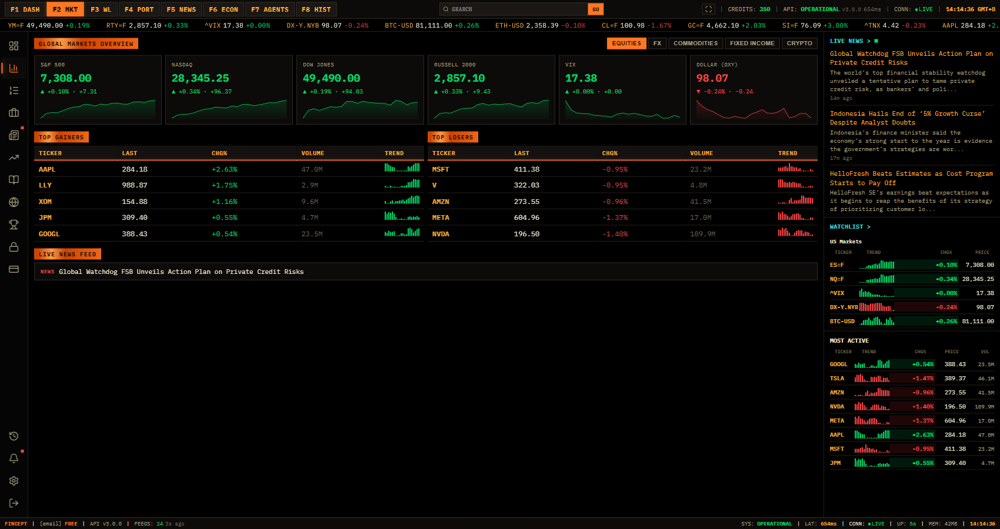
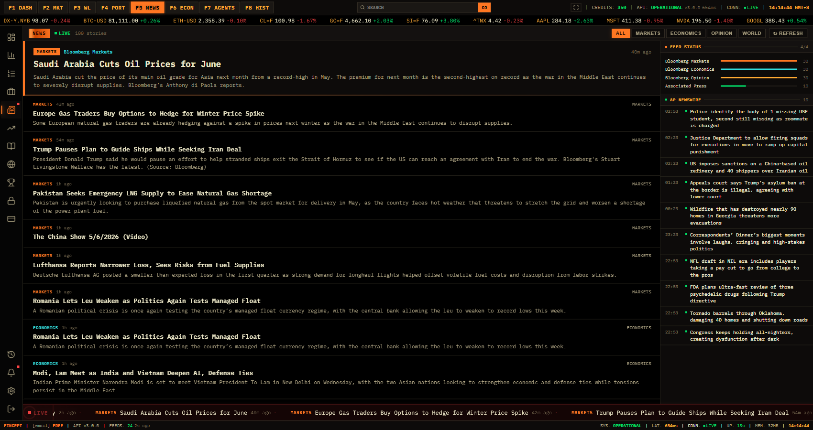
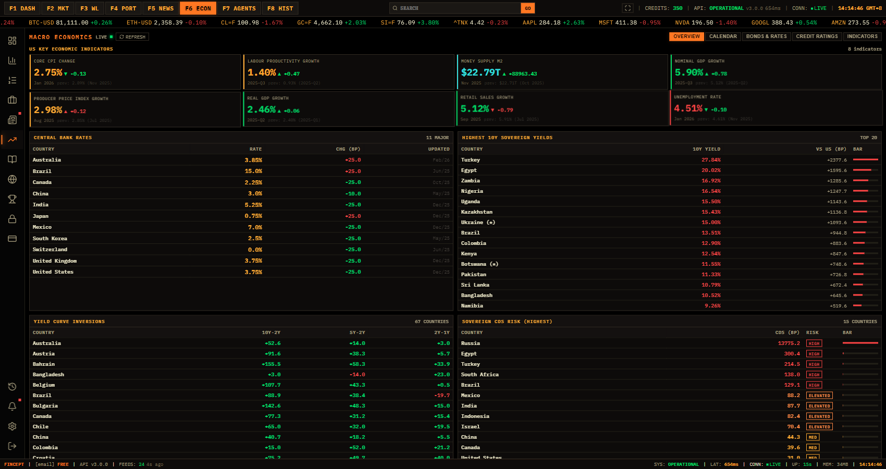
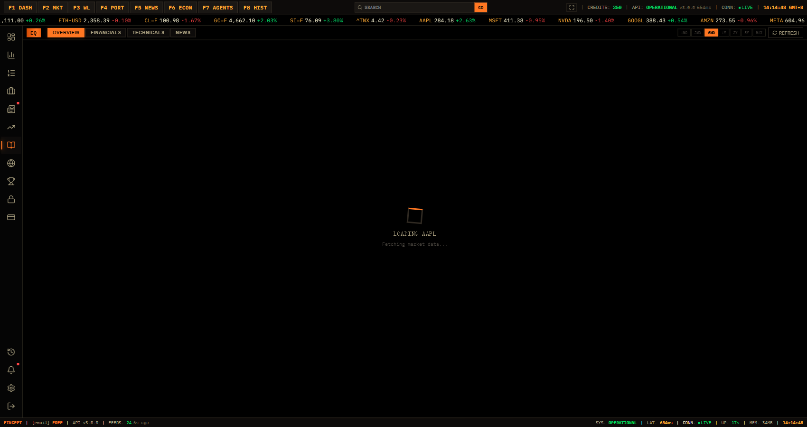
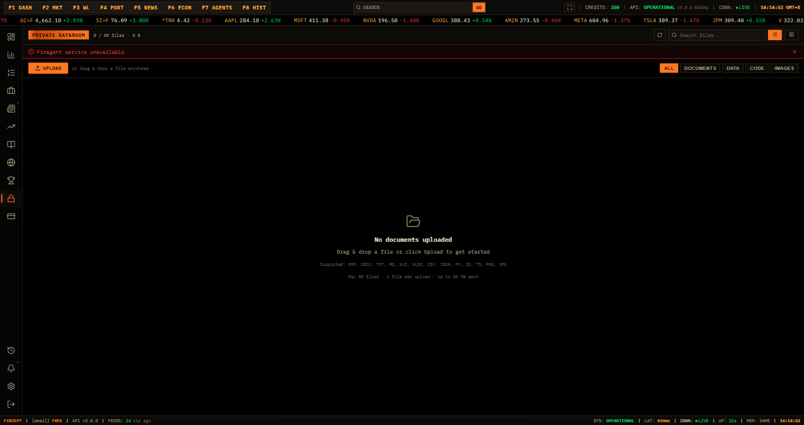
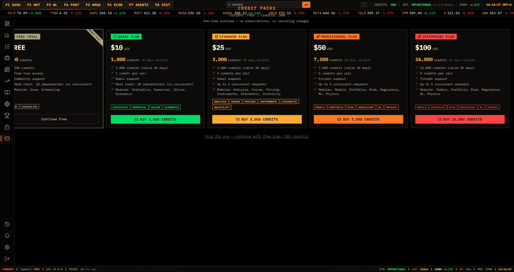
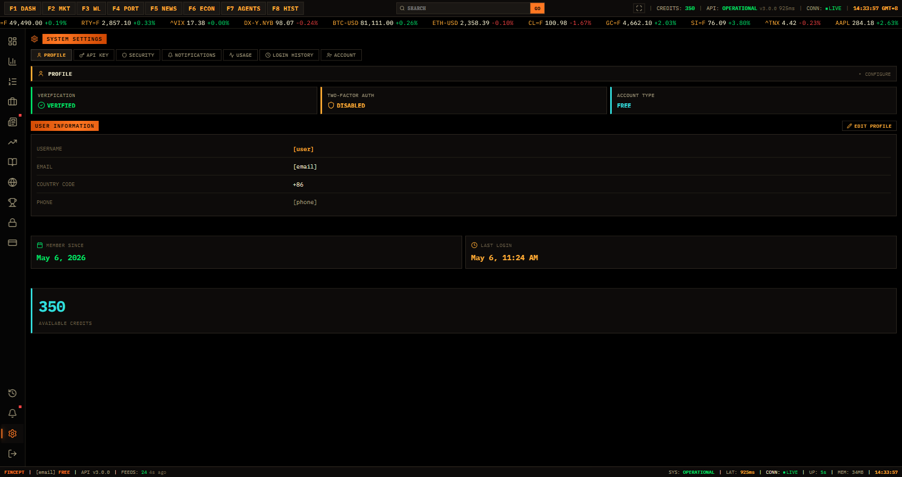

# 登录后功能分类

## 全局功能层

| 功能 | 描述 | 复刻要点 |
| --- | --- | --- |
| F1 DASH | Dashboard 快捷入口 | 橙色激活态，键盘快捷键提示 |
| F2 MKT | Markets 快捷入口 | 顶部和左 rail 双入口同步激活 |
| F3 WL | Watchlist 快捷入口 | 空状态和新建/导入动作 |
| F4 PORT | Portfolio 快捷入口 | 投资组合下拉、创建、导入、刷新 |
| F5 NEWS | News 快捷入口 | 新闻列表、分类筛选、feed 状态 |
| F6 ECON | Economics 快捷入口 | 宏观 overview、calendar、rates、indicators |
| F7 AGENTS | Agentic World 快捷入口 | AI/Agent 相关工作区入口 |
| F8 HIST | History 快捷入口 | 会话或任务历史 |
| Search + GO | 全局命令/资产搜索 | 顶部中心，移动端保留 |
| Status | credits、API、connection、time | 终端产品可信度的重要视觉元素 |

## 侧栏功能入口

抓取覆盖了 14 个主要入口，均可点击并生成截图。

| 入口 | 文件 | 当前主状态 | 关键组件 |
| --- | --- | --- | --- |
| Dashboard | `feature-dashboard.png` | 已加载 | Shortcuts、Agent composer、templates、dataroom、recent sessions |
| Markets | `feature-markets.png` | 已加载 | Global overview、资产类别 tabs、gainers/losers、live news feed |
| Watchlist | `feature-watchlist.png` | 空状态 | 新建 watchlist、导入 symbols |
| Portfolio | `feature-portfolio.png` | 空状态 | portfolio selector、新建、导入、刷新、创建 CTA |
| News | `feature-news.png` | 已加载 | 分类 tabs、新闻列表、右侧 feed status、news ticker |
| Economics | `feature-economics.png` | 已加载 | Overview、calendar、bonds/rates、credit ratings、indicators |
| Research | `feature-research.png` | 已加载 | Overview、financials、technicals、news、时间范围选择 |
| Agentic World | `feature-agentic-world.png` | 已加载 | Agentic 工作区入口 |
| Fund Managers | `feature-fund-managers.png` | 已加载 | rank/return/NAV/drawdown 排序或筛选 |
| Dataroom | `feature-dataroom.png` | 空状态/文件区 | 搜索、上传、类型过滤 |
| Plans & Credits | `feature-plans-credits.png` | 已加载 | credit packs、购买 CTA、free plan continue |
| History | `feature-history.png` | 空状态 | refresh、历史列表容器 |
| Alerts | `feature-alerts.png` | 空状态 | all/unread 筛选 |
| Settings | `feature-settings.png` | 已加载且已脱敏 | Profile、API key、Security、Notifications、Usage、Login history、Account |

## 重点页面拆解

### Markets

参考图：

结构：

- 顶部分类：Equities、FX、Commodities、Fixed Income、Crypto。
- Global Markets Overview：6 个横向 metric card，含 sparkline。
- Top Gainers 和 Top Losers：左右两张表格，每行含 ticker、last、chg%、volume、trend。
- 下方 Live News Feed：单行或多行新闻摘要。
- 右侧 rail 继续显示 Live News、Watchlist、Most Active。

### News

参考图：

结构：

- 顶部标题：News、Live、story count。
- 分类按钮：All、Markets、Economics、Opinion、World、Refresh。
- 左侧主列表：首条大卡片，后续为密集新闻列表。
- 右侧扩展栏：Feed Status 和 AP Newswire。
- 底部新闻 ticker：红黑底，横向滚动。

### Economics

参考图：

结构：

- 顶部 refresh。
- 二级 tabs：Overview、Calendar、Bonds & Rates、Credit Ratings、Indicators。
- 页面应按宏观数据类型分组，维持表格/指标卡风格。

### Research

参考图：

结构：

- 二级 tabs：Overview、Financials、Technicals、News。
- 时间范围：1MO、3MO、6MO、1Y、2Y、5Y、MAX。
- Refresh 操作。
- 适合复刻为股票研究工作台：摘要、图表、财务表、技术指标、相关新闻。

### Dataroom

参考图：

结构：

- 搜索框：Search files。
- 上传按钮：Upload。
- 文件类型 tabs：All、Documents、Data、Code、Images。
- 空状态或文件列表区。

### Plans & Credits

参考图：

结构：

- Credit packs。
- Free continuation。
- 多个购买 CTA：1,000、3,000、7,500、16,000 credits。
- 当前 credits 在顶部和底部状态栏重复呈现。

### Settings

参考图已脱敏：

结构：

- 顶部 tabs：Profile、API Key、Security、Notifications、Usage、Login History、Account。
- Profile panel：verification、two-factor auth、account type。
- User information：username、email、country code、phone。
- Member since、last login、available credits。
- 该页用于复刻结构时应使用 mock 数据，不应使用真实账号数据。

## 空状态模式

Watchlist、Portfolio、History、Alerts、Dataroom 都存在空状态。通用模式：

- 大面积虚线或暗边框容器。
- 居中终端符号或小图标。
- 1 行标题。
- 1 行说明。
- 主按钮为橙色，次按钮为深色边框。
