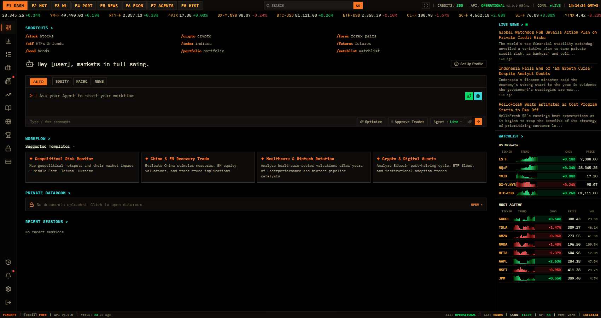
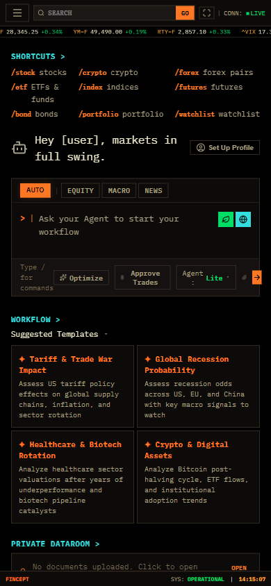
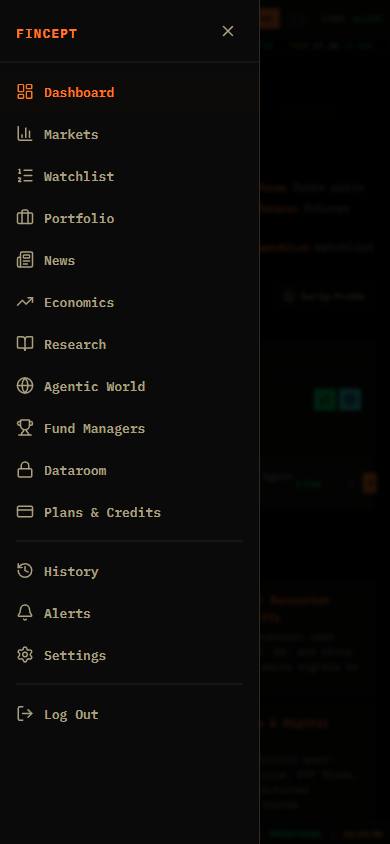

# Fincept 登录后页面前端复刻参考包

生成日期：2026-05-06
目标页面：https://fincept.in/dashboard
工具来源：browser-harness 登录态渲染抓取，Scrapling 认证静态/动态抽取
隐私处理：截图前和文本落盘后均做了账户字段脱敏；cookie 只作为临时请求头使用，未保存到参考包。

## 文件结构

```text
fincept-logged-in-frontend-reference-2026-05-06/
├── README.md
├── FRONTEND_REPLICA_REFERENCE.md
├── FUNCTION_TAXONOMY.md
├── SCRAPING_REPORT.md
├── IMPLEMENTATION_CHECKLIST.md
├── knowledge-pipeline-note.md
├── screenshots/
│   ├── dashboard-desktop.png
│   ├── dashboard-mobile.png
│   ├── dashboard-mobile-menu.png
│   └── feature-*.png
└── data/
    ├── browser-harness-dashboard-analysis.json
    ├── browser-harness-settings-redacted.json
    ├── scrapling-dashboard-auth.html
    ├── scrapling-dashboard-auth.md
    ├── scrapling-dashboard-auth.txt
    ├── scrapling-dashboard-dynamic-auth.md
    └── scrapling-home.md
```

## 推荐阅读顺序

1. `FRONTEND_REPLICA_REFERENCE.md`：页面布局、视觉系统、组件拆分。
2. `FUNCTION_TAXONOMY.md`：登录后功能分类和各页面状态。
3. `SCRAPING_REPORT.md`：browser-harness 与 Scrapling 的抓取结论和限制。
4. `IMPLEMENTATION_CHECKLIST.md`：复刻时可直接使用的开发清单。
5. `screenshots/`：按功能入口逐张核对视觉布局。
6. `data/browser-harness-dashboard-analysis.json`：完整结构化 DOM、尺寸、控件、资源摘要。

## 关键截图

桌面 Dashboard：



移动 Dashboard：



移动菜单：


