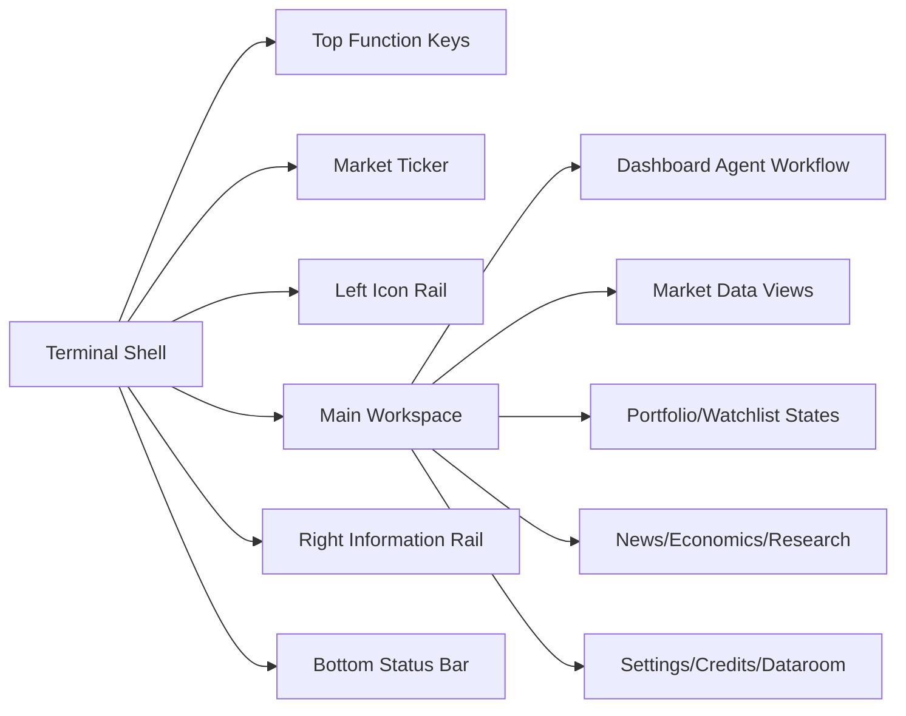

# Knowledge Note: Fincept 登录后终端前端复刻

---
source: https://fincept.in/dashboard
date: 2026-05-06
tools:
  - browser-harness
  - Scrapling
type: frontend-reference
privacy: sanitized
---

## 摘要

Fincept 登录后页面是高信息密度金融终端。复刻重点不是常规 dashboard 卡片，而是终端 shell、实时行情、快捷键、密集表格、新闻流、Agent 工作流和系统状态。

## 核心设计模型

## 复刻优先级

1. 先复刻 Shell：顶部、左侧、右侧、底部、ticker。
2. 再复刻 Dashboard：shortcuts、Agent composer、template cards、dataroom、recent sessions。
3. 然后补 Markets 和 News：它们最能体现金融终端的信息密度。
4. 最后补空状态页面、Settings、Plans & Credits。

## 关键洞察

- 页面以状态可信度为核心：API operational、connection live、latency、feeds、uptime 等文本持续可见。
- 右侧 rail 是桌面信息密度的关键，不应被普通 sidebar 替代。
- 移动端已经具备响应式基础，但触控目标偏小，复刻时应主动修正。
- 原页面的实时内容不适合硬编码，前端复刻应建立 mock data 层。

## 相关文件

- `FRONTEND_REPLICA_REFERENCE.md`
- `FUNCTION_TAXONOMY.md`
- `SCRAPING_REPORT.md`
- `IMPLEMENTATION_CHECKLIST.md`
- `data/browser-harness-dashboard-analysis.json`
- `screenshots/`
