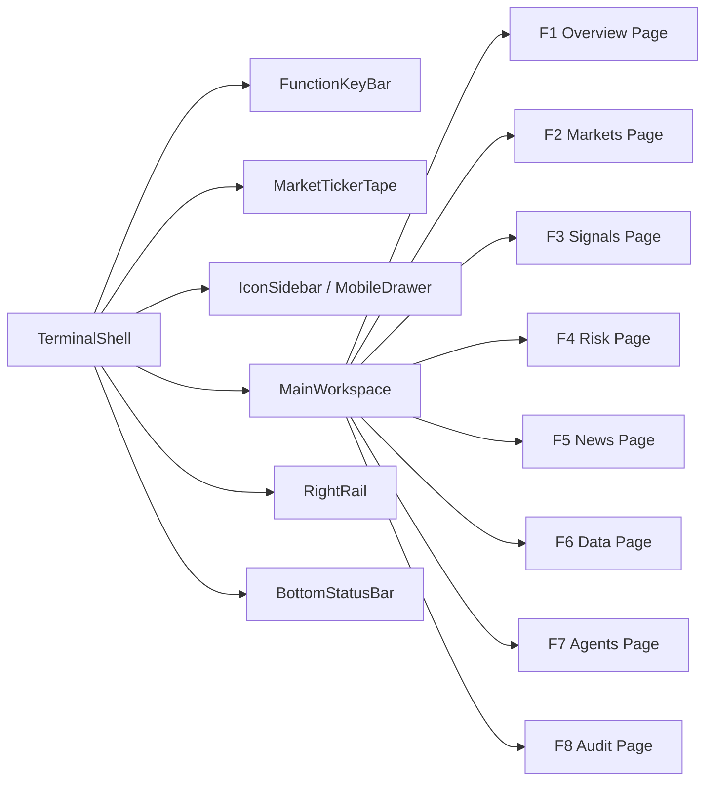
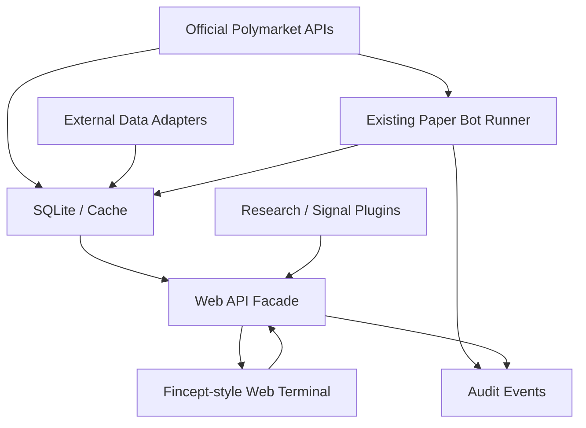

# Polymarket Web Research Architecture Design

Date: 2026-05-06

## Scope

Design a Web-first Polymarket automated trading research and operations terminal by combining the existing FinceptTerminal codebase, the logged-in `fincept.in` frontend reference, the existing Polymarket paper bot, and selected capabilities from the external project list.

This is a research architecture and frontend replication plan. It does not authorize live trading implementation, private-key handling, payment integration, or a desktop-client-first design.

The default frontend is a Web page. The desktop client remains optional and must not define the first implementation target.

## User Decisions

- Frontend target: Web management page, not desktop client.
- Visual baseline: logged-in `https://fincept.in/dashboard`, not only public marketing pages.
- Replication strategy: product prototype first, not pixel-perfect clone first.
- Chosen route: B2, four core workspaces with Fincept terminal shell.
- F1-F8 behavior: global route shortcuts. Each shortcut switches the full central page, not a panel inside one aggregated dashboard.
- Trading mode: paper bot first. Live trading remains disabled until separately designed.
- Charting: `tradingview/lightweight-charts` is the preferred Web chart layer.

## Evidence Base

Primary local reference package:

- `docs/fincept-logged-in-frontend-reference-2026-05-06/README.md`
- `docs/fincept-logged-in-frontend-reference-2026-05-06/FRONTEND_REPLICA_REFERENCE.md`
- `docs/fincept-logged-in-frontend-reference-2026-05-06/FUNCTION_TAXONOMY.md`
- `docs/fincept-logged-in-frontend-reference-2026-05-06/SCRAPING_REPORT.md`
- `docs/fincept-logged-in-frontend-reference-2026-05-06/IMPLEMENTATION_CHECKLIST.md`
- `docs/fincept-logged-in-frontend-reference-2026-05-06/data/browser-harness-dashboard-analysis.json`
- `docs/fincept-logged-in-frontend-reference-2026-05-06/data/browser-harness-settings-redacted.json`
- `docs/fincept-logged-in-frontend-reference-2026-05-06/screenshots/`

The package states that it was generated from browser-harness logged-in rendering and Scrapling authenticated extraction on 2026-05-06. It is sanitized: screenshots and text remove account fields, and cookies are not stored.

Secondary internal design reference:

- `docs/superpowers/specs/2026-04-30-polymarket-paper-bot-design.md`

Current paper-bot modules:

- `fincept-qt/scripts/algo_trading/polymarket_config.py`
- `fincept-qt/scripts/algo_trading/polymarket_edge.py`
- `fincept-qt/scripts/algo_trading/polymarket_models.py`
- `fincept-qt/scripts/algo_trading/polymarket_paper.py`
- `fincept-qt/scripts/algo_trading/polymarket_risk.py`
- `fincept-qt/scripts/algo_trading/polymarket_runner.py`
- `fincept-qt/scripts/algo_trading/polymarket_scanner.py`
- `fincept-qt/scripts/algo_trading/polymarket_sources.py`
- `fincept-qt/scripts/algo_trading/polymarket_store.py`

## Fincept Logged-In Frontend Findings

The logged-in Fincept Web Terminal is a Bloomberg-style financial terminal, not a conventional SaaS dashboard.

The persistent shell has these regions:

- Top function key bar: F1-F8, search, GO, fullscreen, credits, API status, connection, current time.
- Market ticker tape: horizontal scrolling real-time symbols.
- Left icon rail: 14 logged-in feature entries.
- Central main workspace: one active feature page.
- Right information rail: live news, watchlist, most active.
- Bottom status bar: brand, account plan, API, feeds, system, latency, connection, uptime, memory, time.

Desktop baseline:

- Reference viewport: `1700 x 900`.
- No page-level horizontal overflow in captured desktop state.
- Right rail is permanently visible.
- Top function buttons are visually compact and terminal-like.

Mobile baseline:

- Reference viewport: `390 x 844`.
- Left rail becomes hamburger drawer.
- Right rail should not permanently squeeze the main content.
- The original site has many small click targets; the replica must improve touch target height to at least 40px where practical.

Design tokens to preserve:

- Font: `IBM Plex Mono`, `Courier New`, monospace fallback.
- Body size: around 13px.
- H1 size: around 16px.
- Background: black or near-black.
- Primary text: warm off-white.
- Accent: terminal orange.
- Positive/negative: saturated green/red.
- Status cyan/green for API, connection, credits, system health.
- Borders: 1px dark brown/orange, low radius or no radius.

Important accessibility improvements:

- Use native `button` for F1-F8 instead of `span role="button"`.
- Add `aria-label` for icon-only buttons.
- Add explicit labels or `aria-label` to search and agent composer inputs.
- Use `aria-current` or selected state for the active route.
- Use semantic `tablist`, `tab`, and `tabpanel` for true tab widgets.

## Chosen Frontend Architecture

The frontend is a Fincept-style terminal shell with Polymarket-specific route pages.

The shell is persistent. The central `MainWorkspace` changes by route.

Non-negotiable routing rule:

- F1-F8 are global route shortcuts.
- Pressing a shortcut changes the whole central workspace page.
- The design must not implement F1-F8 as panels inside one aggregate dashboard.
- The left icon rail must synchronize with the active route.
- Mobile drawer uses the same route model.

## Route Definitions

### F1 Overview

Purpose:

- The paper bot operations summary page.

Core content:

- Current bot mode: `paper` active, `live` disabled.
- Deployment health and last cycle time.
- Equity, realized/unrealized PnL, exposure, open positions.
- Pending/paper order queue.
- Recent signals, fills, skips, errors.
- Agent composer for research requests and workflow prompts.

Allowed actions:

- Start paper bot.
- Stop paper bot.
- Open selected market in Markets page.
- Open selected signal in Signals page.

Action constraints:

- Start/stop require explicit confirmation and audit entry.
- No private key or live CLOB order action exists in MVP.

### F2 Markets

Purpose:

- Polymarket market discovery and selected market inspection.

Core content:

- Market filters: category, volume, liquidity, expiry, spread, price range.
- Candidate table backed by official Polymarket source/cache data.
- Selected market detail.
- Probability/price chart using `lightweight-charts`.
- Order book summary: best bid, best ask, spread, depth.
- Liquidity and volume stats.
- Related news and event context.

Allowed actions:

- Track/untrack market.
- Send market to Signals page.
- Send market to Agents page for research.

Action constraints:

- No direct trade button in Markets MVP.
- Any trade proposal must route through Signals/Risk/Overview approval flow.

### F3 Signals

Purpose:

- Explain and compare model, heuristic, and agent-generated trade signals.

Core content:

- Current paper-bot edge decisions from `algo_polymarket_signals`.
- Estimated probability, confidence, edge, reason, feature contribution.
- Signal skip reasons from `algo_polymarket_skips`.
- Kronos/TimesFM forecast panels as optional adapters.
- TradingAgents/dexter research summaries as optional advisory evidence.
- Source freshness and data provenance.

Allowed actions:

- Pin signal.
- Request agent explanation.
- Send proposed action to Risk approval queue.

Action constraints:

- Signals is advisory. It cannot execute orders directly.
- AI output may explain or recommend, but it cannot generate market data.

### F4 Risk

Purpose:

- Central risk control and approval surface.

Core content:

- Risk limits: max order, max total exposure, max positions, daily loss limit, max spread, min depth.
- Exposure matrix by category, market, correlated event, expiry bucket.
- Approval queue for paper trades.
- Kill switch.
- Risk rejects and skip history.
- Configuration diff preview before save.

Allowed actions:

- Approve/reject paper trade proposals.
- Change risk limits.
- Trigger kill switch.
- Resume paper mode after halt.

Action constraints:

- All actions require confirmation.
- All changes write audit entries with old value, new value, actor, timestamp, result.
- Kill switch must be visually prominent and reversible only through explicit resume.

### F5 News

Purpose:

- Market-impact news and trend monitoring.

Core content:

- Fincept-style dense news list.
- TrendRadar/RSS/social trend adapters.
- Category filters: politics, macro, crypto, sports, policy, legal, weather, global.
- Impact tags linked to candidate Polymarket markets.
- Source status and freshness.

Allowed actions:

- Link news item to market.
- Send to Agents page for research.
- Pin item to right rail watch context.

Action constraints:

- News is read-only/advisory.
- News source failures degrade to empty/error state without blocking other pages.

### F6 Data

Purpose:

- Data connectors and source health.

Core content:

- Polymarket official APIs: Gamma, CLOB, Data API.
- OpenBB adapter status for financial/economic reference data.
- public-apis discovery backlog.
- Sherlock/OSINT source status where legally and ethically appropriate.
- Cache health, data freshness, schema state.
- Dataroom entry as a future-support feature.

Allowed actions:

- Refresh connector health.
- View source payload metadata.
- Open cache detail.

Action constraints:

- Read-only in MVP, except refresh.
- No credentials or private secrets are entered in this page in MVP.

### F7 Agents

Purpose:

- Event sentinel and multi-agent research workspace.

Core content:

- Event sentinels grouped by domain.
- Research cycles, findings, dissent, confidence.
- TradingAgents-style analyst/risk/trader debate output.
- dexter-style deep research tasks.
- MiroFish scenario simulation as future research plugin.
- Evidence trail and source citations.

Allowed actions:

- Start advisory research cycle.
- Attach market/news context.
- Send recommendation to Signals page.

Action constraints:

- Agents cannot trade.
- Agent output must carry source references and confidence.
- Any generated claim that lacks evidence must be marked as unverified.

### F8 Audit

Purpose:

- Full traceability for bot operations and research decisions.

Core content:

- Trades from `algo_polymarket_paper_trades`.
- Positions from `algo_polymarket_paper_positions`.
- Signals from `algo_polymarket_signals`.
- Skips from `algo_polymarket_skips`.
- Candidates from `algo_polymarket_candidates`.
- Control actions: start, stop, approve, reject, kill switch, config change.
- Error replay and export-ready event log.

Allowed actions:

- Filter/search audit events.
- Export sanitized audit view.
- Replay cycle details from stored source metadata.

Action constraints:

- Audit data is append-only from the UI perspective.
- No delete or edit actions in MVP.

## Mapping From Fincept Pages

The replica should not discard Fincept's logged-in page taxonomy. It should map it to Polymarket operations.

| Fincept Source | Polymarket Web Terminal Target |
| --- | --- |
| Dashboard | F1 Overview |
| Markets | F2 Markets |
| Research | F3 Signals and selected-market research |
| Portfolio | F1 Overview positions and F8 Audit |
| Watchlist | Right rail watchlist plus F2 tracked markets |
| News | F5 News |
| Economics | F6 Data and F5 macro news context |
| Agentic World | F7 Agents |
| Fund Managers | Strategy Arena support page, later under Agents/Audit |
| Dataroom | F6 Data support entry, deferred |
| Plans & Credits | Support/placeholder, deferred |
| History | F8 Audit |
| Alerts | Right rail risk alerts plus F4 Risk |
| Settings | Settings support route, deferred |

## External Project Capability Placement

External projects must be integrated through adapters or research plugins. They must not be placed directly in the paper-bot execution loop in the first Web MVP.

| Project | Observed Capability | Integration Placement | Priority |
| --- | --- | --- | --- |
| FinceptTerminal | Existing finance terminal, market analytics, investment research, economic tools, existing paper bot modules | Base repo and UI style source | P0 |
| lightweight-charts | Performant HTML5 canvas financial charts | F2 Markets chart layer, F1/F8 PnL charts | P0 |
| OpenBB | Financial data platform for analysts, quants, AI agents; data integration layer | F6 Data adapter for reference market/economic data | P1 |
| TrendRadar | Trend/news/RSS aggregation, AI analysis, MCP service support | F5 News and F7 Agents source adapter | P1 |
| TradingAgents | Multi-agent financial trading framework with analyst, trader, risk roles | F7 Agents advisory workflow and F3 explanation layer | P1 |
| dexter | Autonomous financial research agent with planning/self-reflection/market data | F7 deep research plugin | P1 |
| Kronos | Financial candlestick foundation model for K-line/OHLCV forecasting | F3 optional probability/price-series model adapter | P2 |
| TimesFM | Google time-series foundation model for forecasting | F3 baseline/general TS forecast adapter | P2 |
| Sherlock | OSINT username/account discovery across social networks | F6/F7 optional entity research adapter, with strict legal/ethical limits | P2 |
| public-apis | Directory of free APIs | F6 connector discovery backlog, not runtime dependency | P3 |
| MiroFish | Swarm intelligence and scenario simulation engine | F7 scenario lab, research-only | P3 |

## Data Flow

The Web frontend talks to a backend API facade. It must not import or call runner functions directly.

Required API groups:

- `/api/bot/status`
- `/api/bot/control`
- `/api/markets`
- `/api/markets/{id}`
- `/api/signals`
- `/api/risk`
- `/api/news`
- `/api/data/sources`
- `/api/agents`
- `/api/audit`

Initial API facade can read from SQLite and call existing runner orchestration. It should keep the paper bot process boundary explicit.

## Existing Paper Bot Boundary

`polymarket_runner.py` already supports:

- Market scanning.
- Candidate recording.
- Order book fetches through `PolymarketRestSource`.
- Heuristic edge computation.
- Risk checks.
- Paper entry and exit fills.
- Positions.
- Signals.
- Skips.
- Trades.
- SQLite schema creation.

The Web architecture should use these tables as the initial source of truth:

- `algo_polymarket_candidates`
- `algo_polymarket_signals`
- `algo_polymarket_skips`
- `algo_polymarket_paper_trades`
- `algo_polymarket_paper_positions`

Gaps for Web MVP:

- Add a read API for current deployment state.
- Add a control API for paper start/stop.
- Add audit rows for UI control actions.
- Add optional source metadata view for cached payload freshness.
- Add route-friendly summary projections for Overview, Markets, Signals, Risk, and Audit.

## Safety Rules

Trading safety:

- MVP supports paper trading only.
- Live trading controls are disabled and labeled as future scope.
- No private keys, Polymarket API secrets, or live CLOB order paths are exposed.
- AI/Agent output cannot execute trades.
- Signals are advisory until Risk/Overview approval creates an auditable paper action.

Data safety:

- AI must never generate prices, order books, trades, volumes, market status, or source freshness.
- Missing data results in skip/error state, not synthetic replacement.
- Stale data results in skip/error state.
- Empty order book results in skip/error state.
- Source data must preserve provenance metadata where available.

UI safety:

- Start, stop, approve, reject, kill switch, resume, and risk config changes require explicit confirmation.
- Every control action writes an audit entry.
- Audit is append-only from the UI.
- Right rail data failures must not block main page routing.

## MVP Scope

MVP must include:

- Persistent Fincept-style terminal shell.
- F1-F8 route switcher with keyboard shortcuts and clickable buttons.
- Left icon rail synchronized with the current route.
- Right rail with news/watchlist/most-active/risk alerts, backed by mock or adapter data.
- Bottom status bar with API, feeds, latency, connection, uptime, memory, time.
- F1 Overview connected to paper-bot deployment summary.
- F2 Markets with market table, selected market detail, order book summary, and `lightweight-charts`.
- F3 Signals with signal table, edge explanation, skip reasons, and advisory evidence panels.
- F4 Risk with limits, approval queue, kill switch, skips, and risk audit events.
- F8 Audit with trades, signals, positions, candidates, skips, and control actions.
- F5 News, F6 Data, F7 Agents as functional placeholders with adapter boundaries and mock/sample data.
- Mobile responsive shell with drawer navigation and no horizontal overflow.

MVP must not include:

- Live trading.
- Real payment or credits billing.
- Full external-project deep integration.
- Pixel-perfect cloning of every Fincept account/support page.
- Hardcoded real-time news/market/account values from the scrape.
- Direct frontend access to runner internals.

## Component Model

Shell components:

- `TerminalShell`
- `FunctionKeyBar`
- `GlobalCommandSearch`
- `SystemStatusCluster`
- `MarketTickerTape`
- `IconSidebar`
- `MobileMenuDrawer`
- `RightRail`
- `BottomStatusBar`

Route page components:

- `OverviewPage`
- `MarketsPage`
- `SignalsPage`
- `RiskPage`
- `NewsPage`
- `DataPage`
- `AgentsPage`
- `AuditPage`

Reusable terminal UI components:

- `TerminalButton`
- `IconRailButton`
- `MetricCard`
- `DenseDataTable`
- `MarketTable`
- `WatchlistTable`
- `NewsList`
- `FeedStatusPanel`
- `SegmentedControl`
- `AgentComposer`
- `EmptyStatePanel`
- `StatusPill`
- `AuditEventList`
- `RiskLimitEditor`
- `ProbabilityChart`
- `OrderBookSummary`

## Error Handling

Frontend states:

- `loading`
- `ready`
- `empty`
- `stale`
- `partial`
- `error`
- `permission_disabled`

Rules:

- A failed right rail source does not block page load.
- A failed optional adapter shows source-specific error and freshness status.
- A failed paper-bot backend call shows a terminal-style error panel and writes an audit entry if it followed a user action.
- Stale data is visually marked and cannot drive approval.
- Missing order book disables trade proposal actions for that market.
- Risk rejects appear as normal operational outcomes, not application errors.

## Testing and Verification

Visual verification:

- Desktop screenshot at `1700 x 900`.
- Mobile screenshot at `390 x 844`.
- Compare shell regions against `dashboard-desktop.png`, `dashboard-mobile.png`, and `dashboard-mobile-menu.png`.
- Verify no horizontal overflow.

Routing verification:

- Pressing F1-F8 changes the entire central page.
- Clicking top function buttons changes the same route.
- Clicking left rail icons changes the same route.
- Mobile drawer changes the same route.
- `aria-current` or selected state tracks the active route.

Data verification:

- Mock data, API facade data, and SQLite paper-bot data remain separate.
- Overview reads current positions, trades, skips, and signals.
- Markets handles missing/stale/empty order books.
- Signals displays reasons and feature contributions.
- Audit shows control actions and bot events.

Risk verification:

- Approval requires confirmation.
- Kill switch requires confirmation.
- Risk config change shows diff before save.
- Every control action appears in Audit.

Regression verification:

- Existing Polymarket paper-bot tests remain part of backend validation:
  - `python -m pytest fincept-qt/scripts/algo_trading/tests -q --basetemp .pytest_tmp`

## Implementation Sequence

This is not the detailed implementation plan. The recommended implementation sequence is:

1. Build terminal shell and routing scaffold.
2. Build mock data layer and static route pages.
3. Connect Overview and Audit to SQLite paper-bot tables.
4. Connect Markets to market/candidate/order-book summaries.
5. Add `lightweight-charts` probability/PnL charts.
6. Add Signals and Risk pages with advisory and controlled-action boundaries.
7. Add News/Data/Agents placeholders and adapter interfaces.
8. Run desktop/mobile visual verification.
9. Expand adapters only after the core paper-bot operations surface is stable.

## Open Questions For Later Planning

These are intentionally deferred to the implementation plan:

- Which Web stack to use inside this repository for the new frontend.
- Whether the API facade is a FastAPI service, a Next.js API layer, or an existing Fincept service extension.
- Which non-default port to reserve for local frontend/API development.
- Whether the Web frontend lives under `fincept-web/`, `web/`, or a new app package.
- How to package or proxy the optional TrendRadar/OpenBB services.
- Whether to persist `.superpowers/brainstorm/` visual artifacts or keep them local-only.

## Acceptance Criteria

The design is successful when:

- A developer can implement a Web-first Fincept-style terminal without re-reading the full scrape package.
- F1-F8 are clearly understood as independent route shortcuts.
- The shell/route/page boundaries are unambiguous.
- The paper-bot execution boundary is preserved.
- AI/Agent capabilities are advisory and auditable.
- External projects have clear integration placement and priority.
- MVP scope is narrow enough to build without attempting every external integration at once.
