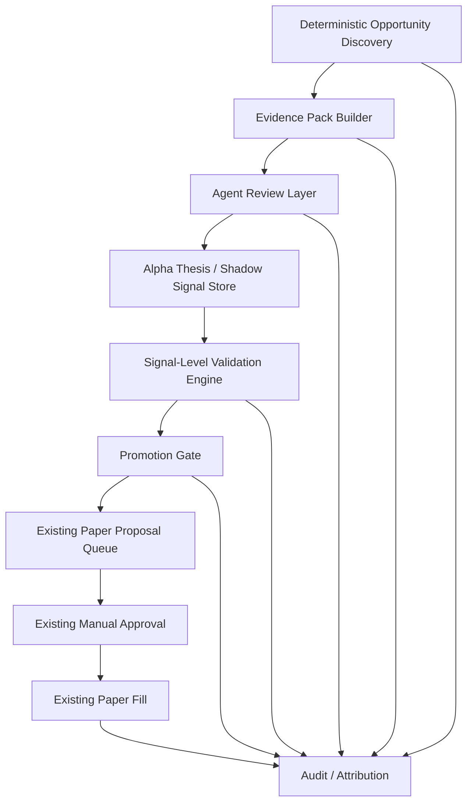

# Poly Alpha Platform Phase 1 Design

Date: 2026-05-07

## Scope

Design **Polymarket Alpha Platform**, abbreviated as **Poly Alpha**.

Poly Alpha's north star is a multi-market event alpha discovery and validation platform. It is not limited to Polymarket or to crypto/financial events in its final form. Future market coverage may include Polymarket, Kalshi, sports odds, macro events, elections, corporate events, commodities, and on-chain events.

Phase 1 is intentionally narrower:

- Market venue: Polymarket.
- Event category: crypto/financial events.
- Trading mode: paper only.
- Product model: opportunity lifecycle first, not pipeline/dashboard first.
- Validation style: deterministic opportunity discovery, evidence pack, agent review, shadow-first validation, promotion gate, manual approval, and paper fills.
- Product entry: reuse the existing Fincept-style Web Terminal pages instead of adding a new primary route.

The Phase 1 goal is to prove that the platform can rapidly discover, validate, reject, promote, and audit alpha hypotheses. It does not promise that the first implemented strategy will be profitable.

## Existing Platform Context

Phase 1 builds on the current Polymarket Web Terminal and paper bot:

- Web frontend: `web/polymarket-terminal/`
- API facade: `fincept-qt/scripts/polymarket_web_api/`
- Paper bot modules: `fincept-qt/scripts/algo_trading/polymarket_*.py`
- Backtest entry: `fincept-qt/scripts/algo_trading/backtest_engine.py`
- Existing proposal/audit storage:
  - `algo_polymarket_trade_proposals`
  - `algo_polymarket_audit_events`

Existing non-negotiable constraints remain in force:

- No live trading.
- No private keys.
- No API secrets.
- No real CLOB order placement path.
- Default proposal flow is `manual_approval`.
- F1-F8 are full-page global route shortcuts.
- Web/API ports remain non-default: Web `4177`, API `8765`.

## User Decisions

- Project name: **Polymarket Alpha Platform**
- Short name: **Poly Alpha**
- Final target: multi-market event alpha discovery and validation.
- Phase 1 scope: Polymarket crypto/financial event alpha discovery and validation.
- Phase 1 success criteria: combined gate model.
- Data sources: Polymarket official data, BTC/ETH/OHLCV or market price data, news/RSS, official announcements, regulatory, ETF, and exchange announcements.
- Social media/search trends are deferred from the Phase 1 core evidence chain.
- Alpha hypothesis families:
  - cross-market probability divergence as the Phase 1 primary execution path
  - event reaction lag as auxiliary evidence and a later validation path
  - resolution/rules understanding as auxiliary evidence and a later validation path
- Product integration: reuse existing F1-F8 pages.
- Agent-to-proposal rule: allow agent-generated proposals only after shadow signal, promotion gate, risk gate, and manual approval.
- Validation model: signal-level validation plus a lightweight event-time check required in Phase 1; full event-level and market-level replay are reserved for later.
- Exit testing: multiple exit templates, reported separately.
- Strategy tracking: every research run, shadow signal, validation result, and promotion decision must carry strategy/config/prompt/source-set version identifiers.

## North Star and Phase 1 Boundary

Poly Alpha should optimize the opportunity lifecycle:

```text
discover opportunity
  -> build evidence pack
  -> run agent review
  -> create structured thesis
  -> shadow signal
  -> validate prediction quality and trading quality
  -> reject / watch / promote
  -> paper proposal
  -> manual approval
  -> paper fill
  -> attribution
```

The platform is successful when it can quickly answer the user's daily trading questions:

- What opportunities exist now?
- Which opportunities are worth research?
- Which opportunities were rejected, and why?
- Which shadow signals are improving or decaying?
- Which signals are ready for paper proposal?
- Which alpha family, strategy version, data source set, and prompt version produced the result?

The system should promote only opportunities with enough evidence, validation, risk clearance, and user approval.

Phase 1 must not turn agents into direct trading authorities. Agents may recommend actions and create structured candidates, but the platform decides promotion through explicit gates, and the user retains manual approval before paper fills.

## Architecture

Phase 1 adds an opportunity lifecycle that produces auditable artifacts and then connects to the existing paper proposal flow. Deterministic scanners create opportunities and evidence packs before any agent analysis runs.



### Opportunity Lifecycle States

Opportunity status is the user's top-level view of an idea. Shadow signal status is a lower-level trading-signal state. Promotion decision is a gate result. These enums must stay separate in APIs and UI filters.

Opportunity statuses:

- `ignored`: discovered but intentionally not researched.
- `watch`: worth watching, not yet a shadow signal.
- `shadow`: has at least one active shadow signal.
- `validated`: has validation results but is not promoted.
- `rejected`: failed a gate or has a blocking reason.
- `promoted`: passed Promotion Gate.
- `proposed`: created a paper proposal.
- `approved`: proposal was manually approved.
- `filled`: paper fill was recorded.
- `expired`: opportunity, shadow signal, or proposal is no longer actionable.

Shadow signal statuses:

- `shadow`
- `validated`
- `rejected`
- `promoted`
- `expired`

Promotion decisions:

- `watch`
- `promote`
- `reject`

### Deterministic Opportunity Discovery

This layer fetches, normalizes, and scans information. It may create opportunity candidates, but it must not create trade proposals or decide trades.

Phase 1 source categories:

- Polymarket Gamma/CLOB/Data API
- BTC/ETH/OHLCV or market price data
- news/RSS
- official announcements
- regulatory announcements
- ETF announcements
- exchange announcements

Every ingested document must persist source metadata:

- source name
- source type
- URL or API endpoint
- `published_at`
- `fetched_at`
- `observed_at`
- payload hash
- normalized text
- raw payload where practical
- trust level

Agents may only cite ingested document IDs and opportunity evidence packs. They must not use uncited web claims as trade evidence.

Phase 1 primary opportunity family:

- `cross_market_probability`: compares Polymarket market probability against external crypto/financial market context such as BTC/ETH spot, futures, volatility, macro calendar, ETF/regulatory/exchange events, and price path conditions.

Phase 1 supported but secondary families:

- `event_lag`: records whether an information event may have moved Polymarket after a delay. It can produce research reports and shadow signals, but full event-level validation is deferred.
- `resolution_rules`: records market title versus resolution criteria ambiguity. It can block promotion or support a thesis, but full standalone rules-alpha validation is deferred.

### Evidence Pack and Event-Market Linking

This layer connects ingested documents, market snapshots, event candidates, and Polymarket contracts into one immutable evidence pack. Agents review the evidence pack; they do not freely fetch facts during decision-making.

Examples:

- BTC ETF news -> BTC-related Polymarket markets.
- ETH price milestone -> ETH event markets.
- Fed/inflation news -> crypto macro markets.
- exchange announcement -> exchange or asset event markets.

The output is an opportunity and evidence pack with:

- opportunity ID
- event ID
- venue
- venue market ID
- venue contract ID
- outcome ID
- outcome
- link reason
- link confidence
- cited document IDs
- cited snapshot IDs
- source-set version

### Agent Research Layer

Phase 1 uses a minimal fixed expert structure:

- **Researcher**: builds the alpha thesis from the evidence pack.
- **Critic**: searches for counter-evidence, timestamp issues, prior pricing, and resolution ambiguity inside the evidence pack.
- **Risk Reviewer**: checks liquidity, spread, order book freshness, risk limits, and promotion eligibility.

Agents are research accelerators and explainers, not the primary source of alpha. The platform must first produce deterministic opportunity candidates and evidence packs. Agent output is invalid if it cites facts outside the persisted evidence pack.

The agent output must be structured:

```text
opportunity_id
strategy_version_id
estimated_probability
market_probability
edge
confidence
thesis
evidence_ids
counter_evidence_ids
resolution_risks
recommended_action: no_trade | watch | shadow_signal | proposal_candidate
```

Natural language summaries are allowed, but they are not sufficient by themselves.

### Shadow Signal Store

All tradable ideas start as shadow signals.

Shadow mode records what the platform would have done without entering the Risk queue and without creating a paper fill. It enables high-volume observation of signal quality while protecting the approval workflow from early-stage noise.

A shadow signal can later be:

- shadow
- validated
- rejected
- promoted
- expired

`shadow` is the initial persisted state. The F3 Signals filter must use the same `shadow` value, not a UI-only alias such as `active`.

No-trade and rejection outcomes must be first-class records, not discarded scans. Required reason codes:

- `late_information`
- `low_liquidity`
- `wide_spread`
- `unclear_resolution`
- `insufficient_edge`
- `critic_blocker`
- `failed_validation`
- `missing_market_snapshot`
- `capacity_too_small`
- `approval_latency_risk`

### Signal-Level Validation Engine

Phase 1 must implement signal-level validation.

The validation anchor is the shadow signal creation time. The engine simulates whether the signal would have been tradable using data available at that time.

Phase 1 validation data sources:

- Historical Polymarket token prices should come from ingested CLOB/Data API price history documents or existing official-source caches when they include source metadata and fetch time.
- Order book, spread, top-of-book depth, and liquidity-at-entry should come from a new persisted snapshot store, `poly_alpha_market_snapshots`, populated by scheduled scans and manual research tasks.
- If no historical order book snapshot exists at or before the signal creation time within the configured freshness window, validation must fail with `missing_market_snapshot` instead of fetching a later book and treating it as historical.
- External BTC/ETH/OHLCV context should come from ingested price-market documents with `observed_at` timestamps.

The Phase 1 default validation freshness window is `300` seconds. This value must live in the same versioned Poly Alpha configuration object as the Promotion Gate defaults, and tests should assert it.

Phase 1 must also implement a lightweight event-time check. It does not need full event-level backtesting, but every validation result must compute:

- `information_lag_sec`: signal creation time minus the latest cited document `published_at` or `observed_at`.
- `fetch_lag_sec`: signal creation time minus the latest cited document `fetched_at`.
- `market_move_before_signal`: Polymarket probability move between the relevant event/document time and signal creation.
- `market_move_after_signal`: Polymarket probability move after signal creation for the selected validation horizon.

If most of the move occurred before the signal, the signal may still be recorded but should fail promotion with `late_information` unless another thesis justifies the entry.

Phase 1 exit templates:

- Fixed horizon: 1h, 6h, 24h, 72h.
- Target/stop: fair value convergence, take profit, stop loss.
- Resolution/expiry: hold until resolution or near expiry where historical data allows.

Each template must be reported separately. A single combined return is not enough because the templates test different alpha mechanisms.

### Promotion Gate

Only promoted signals can enter the existing paper proposal queue.

Exploration gate defaults:

- at least 10 historical events or signal samples
- complete source, fetched time, and payload hash metadata
- structured thesis, evidence, and counter-evidence
- metrics recorded, but profitability not yet required

Promotion gate defaults:

- at least 30 historical signals or 90 days of historical coverage
- cost-adjusted net return greater than zero
- positive median closing-line value after costs
- Brier score and calibration error recorded for resolved markets where outcomes are known
- edge decay recorded for unresolved markets
- maximum drawdown no worse than `-20%`
- hit rate at least `52%` unless payoff ratio is at least `1.5`
- payoff ratio at least `1.1` unless hit rate is at least `60%`
- capacity at quoted price at least `2x` the configured paper order size
- approval latency impact recorded for promoted proposals
- no obvious lookahead bias or survivorship bias
- no unresolved Critic blocker
- Risk Reviewer approval

These defaults must live in a versioned Poly Alpha configuration object. Implementation may expose them as settings later, but Phase 1 tests should assert the defaults above so promotion behavior is deterministic.

Promotion outcomes:

- `promote`
- `reject`
- `watch`

Promotion should evaluate two metric groups separately:

- Prediction quality: calibration error, Brier score where resolved, closing-line value, edge decay, event outcome accuracy where available, and resolution risk rate.
- Trading quality: cost-adjusted return, drawdown, hit rate/payoff ratio, capacity, slippage, spread, and approval latency impact.

### Existing Paper Proposal Flow

Promoted signals create paper proposals with a Poly Alpha source marker. The proposal then follows the existing manual approval flow:

```text
paper proposal
  -> Risk queue
  -> manual approve/reject
  -> recheck order book / freshness / risk / TTL / liquidity
  -> paper fill or skip
  -> audit event
```

Approval must not submit any real CLOB order.

## Data Model

Phase 1 should add Poly Alpha research tables rather than overloading paper trade/proposal tables.

The data model should use multi-market identifiers even though Phase 1 only implements the Polymarket adapter. Polymarket-specific values such as `condition_id` and `asset_id` belong in adapter metadata or dedicated nullable columns, while core joins should use generic venue fields.

### `poly_alpha_config_versions`

Stores deterministic defaults for validation and promotion.

Required fields:

```text
config_version_id
name
validation_freshness_window_sec
min_promotion_samples
min_promotion_history_days
max_drawdown_threshold
min_hit_rate
min_payoff_ratio
min_capacity_multiple
promotion_defaults_json
created_at
is_active
```

Phase 1 default values:

- `validation_freshness_window_sec = 300`
- `min_promotion_samples = 30`
- `min_promotion_history_days = 90`
- `max_drawdown_threshold = -0.20`
- `min_hit_rate = 0.52`
- `min_payoff_ratio = 1.10`
- `min_capacity_multiple = 2.0`

### `poly_alpha_strategy_versions`

Stores the versioned research logic that produced a signal.

Required fields:

```text
strategy_version_id
strategy_family
strategy_name
version
config_version_id
prompt_version
source_set_version
description
created_at
is_active
```

Strategy family values:

- `cross_market_probability`
- `event_lag`
- `resolution_rules`

Phase 1 implementation should make `cross_market_probability` the primary execution path. The other families may produce evidence and shadow signals, but they should not be required to pass full promotion until their validation paths are implemented.

### `poly_alpha_source_sets`

Stores the versioned set of enabled data sources for a strategy run.

Required fields:

```text
source_set_version
name
enabled_sources_json
trust_policy_json
created_at
is_active
```

Phase 1 default source set:

- Polymarket Gamma/CLOB/Data API
- BTC/ETH/OHLCV price source
- news/RSS
- official announcements
- regulatory, ETF, and exchange announcements

### `poly_alpha_opportunities`

Stores the user's opportunity lifecycle object.

Required fields:

```text
opportunity_id
strategy_version_id
venue
venue_market_id
venue_contract_id
outcome_id
title
alpha_family
status
primary_reason
market_probability
estimated_probability
edge
confidence
created_at
updated_at
```

Opportunity statuses:

- `ignored`
- `watch`
- `shadow`
- `validated`
- `rejected`
- `promoted`
- `proposed`
- `approved`
- `filled`
- `expired`

Primary reason codes:

- `late_information`
- `low_liquidity`
- `wide_spread`
- `unclear_resolution`
- `insufficient_edge`
- `critic_blocker`
- `failed_validation`
- `missing_market_snapshot`
- `capacity_too_small`
- `approval_latency_risk`

### `poly_alpha_evidence_packs`

Stores the immutable evidence set that agents are allowed to analyze.

Required fields:

```text
evidence_pack_id
opportunity_id
strategy_version_id
document_ids_json
snapshot_ids_json
event_ids_json
source_set_version
latest_published_at
latest_fetched_at
latest_observed_at
created_at
payload_hash
```

Agents must cite an evidence pack. Agent findings that reference uncaptured facts are invalid.

### `poly_alpha_documents`

Stores ingested evidence.

Required fields:

```text
document_id
source_type
source_name
url
api_endpoint
market_id
venue
venue_market_id
venue_contract_id
outcome_id
asset_symbol
topic
published_at
fetched_at
observed_at
payload_hash
title
normalized_text
raw_payload_json
trust_level
created_at
```

Constraints:

- `payload_hash` should deduplicate documents from the same source where practical.
- Agent findings must cite document IDs.
- `published_at`, `fetched_at`, and `observed_at` must remain distinct.

### `poly_alpha_events`

Stores event candidates.

Required fields:

```text
event_id
event_type
title
summary
primary_assets_json
event_time
status
created_at
updated_at
```

Suggested event types:

- `crypto_price`
- `macro`
- `etf`
- `regulatory`
- `exchange`
- `protocol`
- `other`

### `poly_alpha_event_market_links`

Stores event-to-market relationships.

Required fields:

```text
link_id
event_id
venue
venue_market_id
venue_contract_id
outcome_id
adapter_metadata_json
outcome
link_reason
link_confidence
created_at
```

### `poly_alpha_research_runs`

Stores a research task.

Required fields:

```text
run_id
trigger_type
opportunity_id
evidence_pack_id
strategy_version_id
event_id
venue
venue_market_id
requested_by
started_at
completed_at
status
model_config_json
created_at
```

Trigger types:

- `scheduled_scan`
- `manual_task`

### `poly_alpha_agent_findings`

Stores structured outputs from Researcher, Critic, and Risk Reviewer.

Required fields:

```text
finding_id
run_id
opportunity_id
evidence_pack_id
strategy_version_id
agent_role
estimated_probability
market_probability
edge
confidence
recommendation
thesis
evidence_ids_json
counter_evidence_ids_json
resolution_risks_json
blockers_json
created_at
```

### `poly_alpha_shadow_signals`

Stores shadow signals.

Required fields:

```text
shadow_signal_id
opportunity_id
run_id
strategy_version_id
strategy_family
venue
venue_market_id
venue_contract_id
outcome_id
adapter_metadata_json
side
observed_price
estimated_probability
edge
confidence
status
created_at
expires_at
```

Strategy families:

- `event_lag`
- `cross_market_probability`
- `resolution_rules`

Status values:

- `shadow`
- `validated`
- `rejected`
- `promoted`
- `expired`

The API and UI must use these exact values.

### `poly_alpha_market_snapshots`

Stores official-source market data snapshots used by validation.

Required fields:

```text
snapshot_id
venue
venue_market_id
venue_contract_id
outcome_id
adapter_metadata_json
source_api
observed_at
fetched_at
payload_hash
best_bid
best_ask
spread
top_bid_depth
top_ask_depth
mid_price
last_trade_price
liquidity
volume
raw_payload_json
created_at
```

The validation engine may only use snapshots with `observed_at <= shadow_signal.created_at` and within the default `300` second freshness window unless a versioned Poly Alpha configuration overrides that value. Missing snapshots must produce an explicit failed validation result.

### `poly_alpha_validation_results`

Stores validation results for one shadow signal and one exit template.

Required fields:

```text
validation_id
opportunity_id
shadow_signal_id
strategy_version_id
entry_snapshot_id
exit_snapshot_id
validation_type
entry_price
exit_price
holding_period
gross_return
cost_adjusted_return
closing_line_value
brier_score
calibration_error
edge_decay
information_lag_sec
fetch_lag_sec
market_move_before_signal
market_move_after_signal
max_adverse_excursion
max_favorable_excursion
liquidity_assumption
slippage_assumption
pass_fail
failure_reason
created_at
```

Validation types:

- `fixed_horizon`
- `target_stop`
- `resolution_expiry`

### `poly_alpha_promotion_decisions`

Stores the gate decision.

Required fields:

```text
promotion_id
opportunity_id
shadow_signal_id
strategy_version_id
decision
reason
prediction_metrics_json
trading_metrics_json
metrics_json
critic_blockers_json
risk_checks_json
proposal_id
decided_at
```

Decisions:

- `promote`
- `reject`
- `watch`

## Audit Events

Poly Alpha actions must be visible in F8 Audit, either by writing to `algo_polymarket_audit_events` directly or by exposing a unified audit API/view.

Required audit actions:

- `config_version_created`
- `strategy_version_created`
- `opportunity_discovered`
- `document_ingested`
- `evidence_pack_created`
- `event_linked`
- `research_started`
- `research_completed`
- `shadow_signal_created`
- `validation_completed`
- `opportunity_rejected`
- `opportunity_watch`
- `promotion_approved`
- `promotion_rejected`
- `promotion_watch`
- `proposal_created`
- `proposal_approved`
- `proposal_rejected`
- `paper_fill_recorded`

A promoted proposal should be traceable back to:

- strategy version
- opportunity
- evidence pack
- source documents
- event candidate
- market link
- research run
- agent findings
- shadow signal
- validation results
- promotion decision
- proposal decision
- paper fill or skip

## Web Terminal Mapping

Phase 1 reuses the existing F1-F8 page model and does not add a competing primary route. However, the user-facing daily workflow needs a single cockpit. F7 Agents should therefore become the default **Poly Alpha Cockpit** surface while still containing the underlying agent task tools.

The cockpit answers:

- What opportunities exist now?
- Which opportunities need research?
- Which shadow signals are improving or decaying?
- Which signals are ready for promotion?
- Which proposals are ready for Risk queue review?
- What failed, and why?
- Which strategy version produced the result?

### F2 Markets

Purpose:

- inspect Polymarket crypto/financial candidate markets and linked events.

Poly Alpha additions:

- linked event count
- latest evidence timestamp
- market probability versus estimated probability
- liquidity, spread, and order book freshness
- link confidence

Actions:

- track market
- open linked event
- send to research
- view shadow signals

### F3 Signals

Purpose:

- primary Poly Alpha signal board.

Displays:

- alpha thesis
- strategy family
- strategy version
- shadow signal status
- opportunity status
- estimated probability
- market probability
- edge
- confidence
- validation gate status
- promotion result
- closing-line value
- calibration/Brier metrics where available
- primary no-trade or rejection reason

Filters are split by type.

Shadow signal status filters:

- `shadow`
- `validated`
- `rejected`
- `promoted`
- `expired`

Promotion decision filters:

- `watch`
- `promote`
- `reject`

`watch` is not a shadow signal status. It is only a promotion decision filter.

### F4 Risk

Purpose:

- unchanged manual approval queue.

Poly Alpha additions:

- `source: poly_alpha`
- `shadow_signal_id`
- `promotion_id`
- evidence chain link

Risk queue must only show promoted proposals, not raw shadow signals.

### F5 News

Purpose:

- information acquisition, evidence packs, and event flow.

Displays:

- ingested documents
- source type
- published/fetched/observed timestamps
- payload hash
- linked markets
- event candidates
- evidence packs
- opportunity links

Actions:

- run scan now
- open source
- send event to agents

### F7 Agents / Poly Alpha Cockpit

Purpose:

- daily Poly Alpha cockpit plus manual research task entry and agent output review.

Supports:

- scheduled scan review
- manual research task
- opportunity queue
- evidence pack review
- shadow signal performance
- promotion readiness
- paper proposal readiness
- no-trade and rejection reason review

Manual task input may include:

- market ID
- event keyword
- asset symbol
- source URL

Output groups:

- Today's opportunities
- Needs research
- Shadow performance
- Ready for promotion
- Risk queue candidates
- Failed and why
- Researcher finding
- Critic finding
- Risk Reviewer finding
- final structured thesis

### F8 Audit

Purpose:

- complete evidence chain and attribution.

F8 must allow a user to inspect the lineage from ingested document to final paper fill or rejection.

## API Boundary

The Web app should continue to call API endpoints rather than Python runner internals.

Suggested API groups:

- `/api/poly-alpha/config-versions`
- `/api/poly-alpha/source-sets`
- `/api/poly-alpha/strategy-versions`
- `/api/poly-alpha/opportunities`
- `/api/poly-alpha/evidence-packs`
- `/api/poly-alpha/documents`
- `/api/poly-alpha/events`
- `/api/poly-alpha/links`
- `/api/poly-alpha/research-runs`
- `/api/poly-alpha/findings`
- `/api/poly-alpha/shadow-signals`
- `/api/poly-alpha/validations`
- `/api/poly-alpha/promotions`

Control endpoints must be paper-safe:

- trigger deterministic scheduled scan
- trigger manual research task
- build evidence pack
- run signal validation
- decide promotion
- create paper proposal from promoted signal

No endpoint may accept private keys, API secrets, or live order parameters.

## Testing Strategy

### Backend Tests

Required coverage:

- versioned config defaults are deterministic
- source set versions attach to evidence packs and strategy versions
- strategy version IDs attach to research runs, signals, validations, and promotions
- opportunity lifecycle supports ignored/watch/shadow/validated/rejected/promoted/proposed/approved/filled/expired
- document ingestion deduplicates by payload hash
- timestamp semantics preserve `published_at`, `fetched_at`, and `observed_at`
- evidence packs include cited documents and snapshots
- agent findings require cited evidence pack IDs
- event-market links persist link confidence and reason
- shadow signal lifecycle
- no-trade and rejection reason codes persist
- event-time check computes information lag and pre/post signal market moves
- validation templates produce separate results
- validation records CLV, Brier/calibration where available, and edge decay
- promotion gate supports `promote`, `reject`, and `watch`
- promotion gate evaluates prediction quality and trading quality separately
- proposal creation only happens after promotion
- shadow signals do not appear in the Risk queue
- paper-only boundaries reject live trading fields
- audit chain is complete

### Frontend Tests

Required coverage:

- F7 Cockpit displays opportunity queue, shadow performance, promotion readiness, failed reasons, and Risk queue candidates
- F2/F3/F5/F7/F8 display Poly Alpha state
- F3 separates shadow signal status filters from promotion decision filters
- F4 Risk only displays promoted proposals
- evidence chain links are visible
- F1-F8 remain full-page global routes
- no secret/private-key inputs are rendered

### E2E Test

Required happy path:

```text
manual research task
  -> opportunity
  -> evidence pack
  -> mocked agent findings
  -> shadow signal
  -> event-time check
  -> validation
  -> promotion
  -> Risk queue proposal
  -> manual approve
  -> paper fill
  -> F8 evidence chain
```

Required negative path:

```text
opportunity with unresolved Critic blocker
  -> validation/review
  -> promotion rejected
  -> no Risk queue proposal
  -> audit records rejection
```

## Risk Controls

### Lookahead Bias

Validation must use the shadow signal creation time as the reference point. Data fetched after that time cannot be treated as available at signal creation.

### Agent Hallucination

Agents can summarize and reason, but they cannot create facts. Structured findings must cite persisted evidence pack IDs and document IDs.

### Low-Liquidity False Profit

Validation must account for spread, slippage, top-of-book depth, and capacity. A signal with theoretical edge but insufficient liquidity should fail or stay in `watch`.

### Proposal Noise

All ideas start in shadow mode. Only promoted signals enter F4 Risk.

### Missing No-Trade Attribution

No-trade outcomes are useful research data. Scans and research runs that do not create shadow signals must still record a primary reason code where practical.

### Resolution Ambiguity

Critic must produce `resolution_risks_json` and `blockers_json`. Unresolved blockers prevent promotion.

### Live Trading Leakage

Phase 1 must not add:

- private key fields
- API secret fields
- authenticated CLOB order clients
- live order endpoints
- live trading mode toggles

## Open Extensions

These are intentionally deferred and must not block Phase 1 planning:

- social media and search trend evidence adapters
- event-level validation
- market-level historical replay
- Kalshi and sports odds adapters
- live trading
- autonomous approval
- portfolio-level live capital allocation
